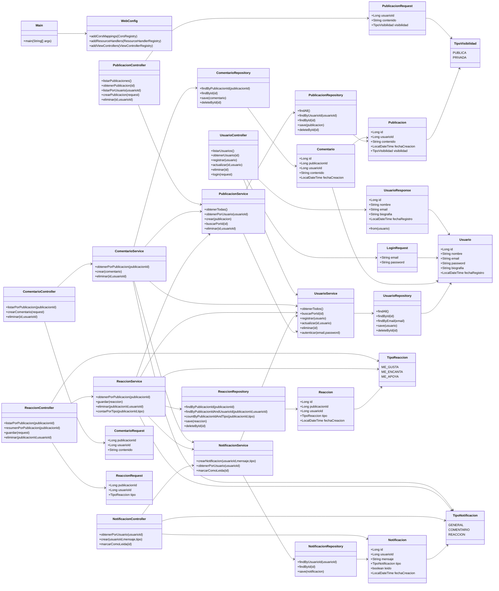

```mermaid

classDiagram
    direction LR

    class Main {
        +main(String[] args)
    }

    class WebConfig {
        +addCorsMappings(CorsRegistry)
        +addResourceHandlers(ResourceHandlerRegistry)
        +addViewControllers(ViewControllerRegistry)
    }

    class Usuario {
        +Long id
        +String nombre
        +String email
        +String password
        +String biografia
        +LocalDateTime fechaRegistro
    }

    class Publicacion {
        +Long id
        +Long usuarioId
        +String contenido
        +LocalDateTime fechaCreacion
        +TipoVisibilidad visibilidad
    }

    class Comentario {
        +Long id
        +Long publicacionId
        +Long usuarioId
        +String contenido
        +LocalDateTime fechaCreacion
    }

    class Reaccion {
        +Long id
        +Long publicacionId
        +Long usuarioId
        +TipoReaccion tipo
        +LocalDateTime fechaCreacion
    }

    class Notificacion {
        +Long id
        +Long usuarioId
        +String mensaje
        +TipoNotificacion tipo
        +boolean leido
        +LocalDateTime fechaCreacion
    }

    class UsuarioController {
        +listarUsuarios()
        +obtenerUsuario(id)
        +registrar(usuario)
        +actualizar(id,usuario)
        +eliminar(id)
        +login(request)
    }

    class PublicacionController {
        +listarPublicaciones()
        +obtenerPublicacion(id)
        +listarPorUsuario(usuarioId)
        +crearPublicacion(request)
        +eliminar(id,usuarioId)
    }

    class ComentarioController {
        +listarPorPublicacion(publicacionId)
        +crearComentario(request)
        +eliminar(id,usuarioId)
    }

    class ReaccionController {
        +listarPorPublicacion(publicacionId)
        +resumenPorPublicacion(publicacionId)
        +guardar(request)
        +eliminar(publicacionId,usuarioId)
    }

    class NotificacionController {
        +obtenerPorUsuario(usuarioId)
        +crear(usuarioId,mensaje,tipo)
        +marcarComoLeida(id)
    }

    class UsuarioService {
        +obtenerTodos()
        +buscarPorId(id)
        +registrar(usuario)
        +actualizar(id,usuario)
        +eliminar(id)
        +autenticar(email,password)
    }

    class PublicacionService {
        +obtenerTodas()
        +obtenerPorUsuario(usuarioId)
        +crear(publicacion)
        +buscarPorId(id)
        +eliminar(id,usuarioId)
    }

    class ComentarioService {
        +obtenerPorPublicacion(publicacionId)
        +crear(comentario)
        +eliminar(id,usuarioId)
    }

    class ReaccionService {
        +obtenerPorPublicacion(publicacionId)
        +guardar(reaccion)
        +eliminar(publicacionId,usuarioId)
        +contarPorTipo(publicacionId,tipo)
    }

    class NotificacionService {
        +crearNotificacion(usuarioId,mensaje,tipo)
        +obtenerPorUsuario(usuarioId)
        +marcarComoLeida(id)
    }

    class UsuarioRepository {
        +findAll()
        +findById(id)
        +findByEmail(email)
        +save(usuario)
        +deleteById(id)
    }

    class PublicacionRepository {
        +findAll()
        +findByUsuarioId(usuarioId)
        +findById(id)
        +save(publicacion)
        +deleteById(id)
    }

    class ComentarioRepository {
        +findByPublicacionId(publicacionId)
        +findById(id)
        +save(comentario)
        +deleteById(id)
    }

    class ReaccionRepository {
        +findByPublicacionId(publicacionId)
        +findByPublicacionIdAndUsuarioId(publicacionId,usuarioId)
        +countByPublicacionIdAndTipo(publicacionId,tipo)
        +save(reaccion)
        +deleteById(id)
    }

    class NotificacionRepository {
        +findByUsuarioId(usuarioId)
        +findById(id)
        +save(notificacion)
    }

    class LoginRequest {
        +String email
        +String password
    }

    class UsuarioResponse {
        +Long id
        +String nombre
        +String email
        +String biografia
        +LocalDateTime fechaRegistro
        +from(usuario)
    }

    class PublicacionRequest {
        +Long usuarioId
        +String contenido
        +TipoVisibilidad visibilidad
    }

    class ComentarioRequest {
        +Long publicacionId
        +Long usuarioId
        +String contenido
    }

    class ReaccionRequest {
        +Long publicacionId
        +Long usuarioId
        +TipoReaccion tipo
    }

   class TipoVisibilidad {
        PUBLICA
        PRIVADA
    }

   class TipoReaccion {
        ME_GUSTA
        ME_ENCANTA
        ME_APOYA
    }

  class TipoNotificacion {
        GENERAL
        COMENTARIO
        REACCION
    }

    UsuarioController --> UsuarioService
    UsuarioController --> UsuarioResponse
    UsuarioController --> LoginRequest
    UsuarioResponse --> Usuario
    LoginRequest --> Usuario

    PublicacionController --> PublicacionService
    PublicacionController --> PublicacionRequest
    PublicacionRequest --> TipoVisibilidad
    Publicacion --> TipoVisibilidad

    ComentarioController --> ComentarioService
    ComentarioController --> ComentarioRequest
    ComentarioService --> ComentarioRepository
    ComentarioService --> PublicacionService
    ComentarioService --> UsuarioService
    ComentarioService --> NotificacionService
    ComentarioService --> TipoNotificacion
    Comentario --> Publicacion
    Comentario --> Usuario

    ReaccionController --> ReaccionService
    ReaccionController --> ReaccionRequest
    ReaccionController --> TipoReaccion
    ReaccionService --> ReaccionRepository
    ReaccionService --> PublicacionService
    ReaccionService --> UsuarioService
    ReaccionService --> NotificacionService
    ReaccionService --> TipoNotificacion
    ReaccionService --> TipoReaccion
    Reaccion --> TipoReaccion

    NotificacionController --> NotificacionService
    NotificacionController --> Notificacion
    NotificacionController --> TipoNotificacion
    NotificacionService --> NotificacionRepository
    NotificacionService --> UsuarioService
    Notificacion --> TipoNotificacion

    PublicacionService --> PublicacionRepository
    PublicacionService --> UsuarioService
    PublicacionRepository --> Publicacion

    UsuarioService --> UsuarioRepository
    UsuarioRepository --> Usuario

    ReaccionRepository --> Reaccion
    ComentarioRepository --> Comentario
    NotificacionRepository --> Notificacion

    Main --> WebConfig
```
